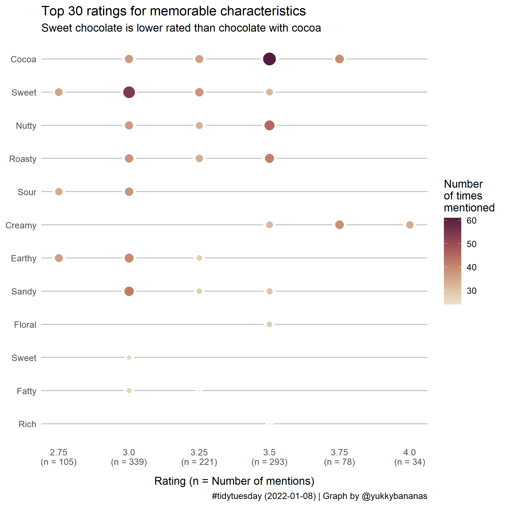

# TidyTuesday

Some of my contributions to the #tidytuesday challenges.

TidyTuesday challenges are found on the `rfordatascience` github, here <https://github.com/rfordatascience/tidytuesday>.

Note that plots are in my order (newest at the top) and not date order.

## 2020-04-20 [Netflix Shows](https://github.com/rfordatascience/tidytuesday/tree/eedfa9fe5c39d973502f00b2574ba14bff7ed82b/data/2021/2021-04-20)

## 2022-09-06 [Lego Sets](https://github.com/rfordatascience/tidytuesday/tree/master/data/2022/2022-09-06)

Three plots in one. So many more to do!

## 2022-01-18 [Chocolate Ratings](https://github.com/rfordatascience/tidytuesday/tree/master/data/2022/2022-01-18)

